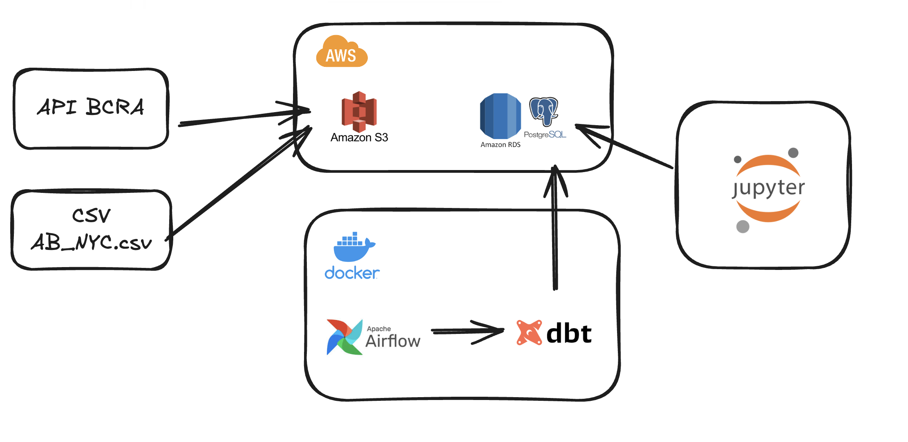
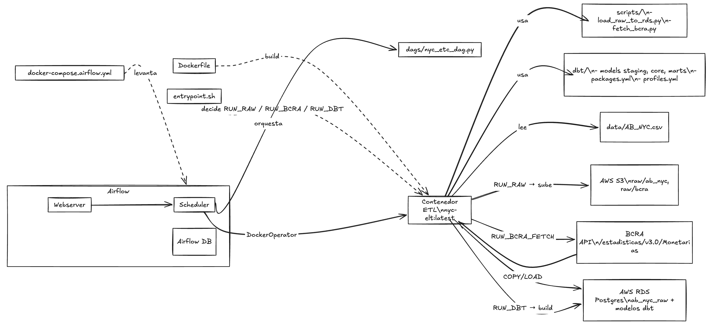
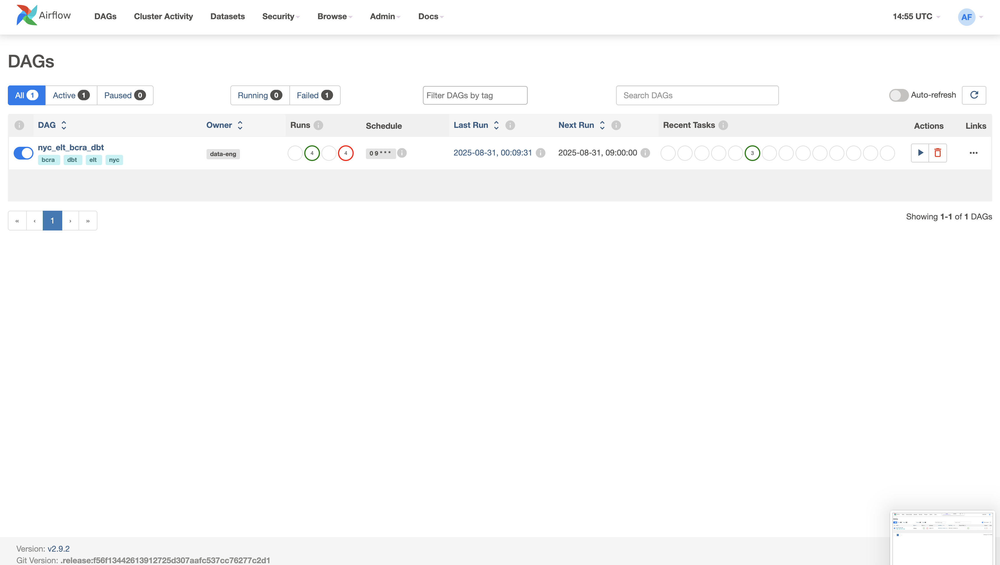
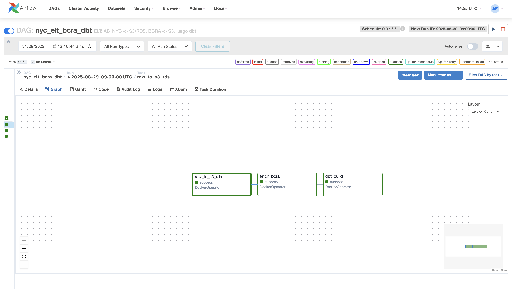
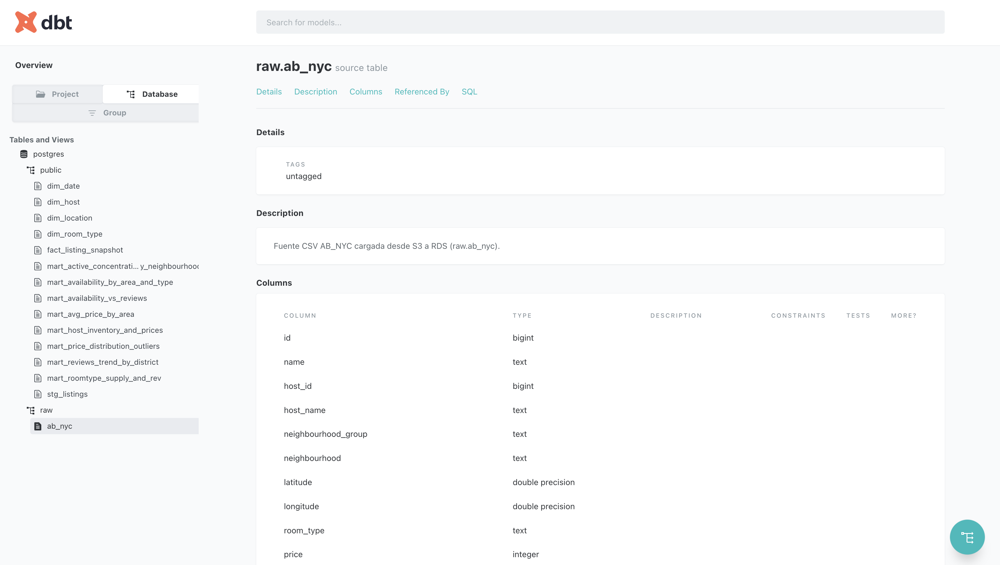
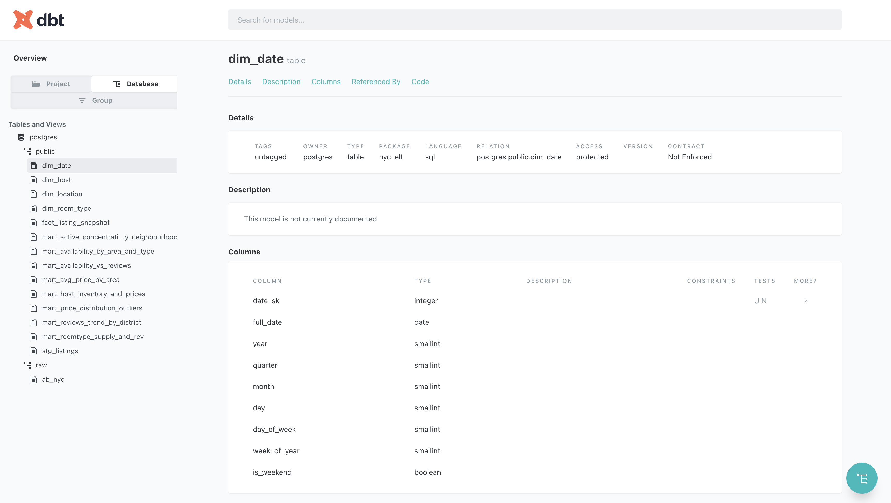

# Proyecto ELT con Airflow, DBT y PostgreSQL en AWS

Este proyecto implementa un pipeline de ingesta, modelado y análisis de datos utilizando **Airflow**, **DBT**, **PostgreSQL** y **Docker**. Está diseñado como un entorno de práctica para la construcción de data pipelines modernos (arquitectura medallón) y la exploración de datasets como *Airbnb NYC* y datos del **BCRA**.

---

## 🚀 Tecnologías utilizadas

- **Python 3.8+**
- **PostgreSQL**
- **DBT (Data Build Tool)**
- **Apache Airflow**
- **Docker & Docker Compose**
- **PgAdmin**


---

## 📂 Estructura del Proyecto

```
.
├── assets/                        # Prints de pantalla y evidencia
├── airflow/                        # Configuración de Airflow (DAGs, metadatos, logs)
├── dags/                           # DAGs de Airflow para orquestación de procesos
├── data/                           # Datasets de entrada
│   └── AB_NYC.csv                  # Dataset de Airbnb NYC
├── dbt/                            # Proyecto de modelado analítico con DBT
│   ├── models/
│   │   ├── core/                   # Modelos de dimensiones y hechos base
│   │   │   ├── dim_date.sql
│   │   │   ├── dim_host.sql
│   │   │   ├── dim_location.sql
│   │   │   ├── dim_room_type.sql
│   │   │   └── fact_listing_snapshot.sql
│   │   ├── marts/                  # Modelos de negocio / KPIs
│   │   │   ├── mart_avg_price_by_area.sql
│   │   │   ├── mart_host_inventory_and_prices.sql
│   │   │   ├── mart_reviews_trend_by_district.sql
│   │   │   └── ...
│   │   └── staging/                # Modelos de staging (limpieza y estandarización)
│   │       └── stg_listings.sql
│   ├── sources.yml                 # Definición de fuentes de datos
│   ├── dbt_project.yml             # Configuración principal de DBT
│   ├── packages.yml                # Dependencias DBT
│   └── profiles.yml                # Perfil de conexión a PostgreSQL
├── logs/                           # Logs de ejecución
├── scripts/                        # Scripts de ingesta y soporte
│   ├── fetch_bcra.py               # Obtiene datos desde la API del BCRA
│   ├── load_raw_to_rds.py          # Carga de datos crudos a PostgreSQL/RDS
│   └── docker-compose.airflow.yml  # Configuración de contenedores con Airflow
├── nyc_elt_colab.ipynb             # Notebook de análisis
├── Dockerfile                      # Imagen base del proyecto
├── entrypoint.sh                   # Script de inicialización de contenedor
├── requirements.txt                # Dependencias Python
└── readme.md                       # Documentación
└── Proyecto_Integrador_III.pdf                      # Documentación principal del proyecto
```

---

## Archivos 

### Archivo Google Colab nyc_elt_colab.ipynb

En este archivo se puede ver el contenido de las principales tablas tanto de hecho como de dimensiones.
Tambien están las consultas, análisis y los gráficos de las preguntas de negocio.


### Archivo Google Proyecto_Integrador_III.pdf

Aqui está documentado las siguientes elementos:
* Objetivo del proyecto
* Arquitectura
* Arquitectura técnica
* Justificación de la arquitectura
* Modelado de las tablas
* Evidencia Airflow y DBT


## 📊 Flujo del Pipeline

1. **Extracción**
   - `fetch_bcra.py`: Llama a la API del BCRA y descarga series temporales económicas.
   - Dataset `AB_NYC.csv`: Datos de alojamientos de Airbnb en NYC.

2. **Carga**
   - `load_raw_to_rds.py`: Inserta datos crudos en PostgreSQL (local o RDS en AWS).
   - `docker-compose.airflow.yml`: Levanta contenedores de Airflow para orquestar las tareas de ETL.

3. **Transformación**
   - DBT organiza el modelado en 3 capas:
     - **Staging**: limpieza y estandarización (`stg_`).
     - **Core**: dimensiones y hechos (`dim_`, `fact_`).
     - **Marts**: KPIs y métricas de negocio (`mart_`).

4. **Orquestación**
   - Airflow ejecuta los DAGs definidos en `/dags`, que automatizan extracción, carga y ejecución de modelos DBT.

---

## Diagrama de Arquitectura



## Diagrama Técnico de Arquitectura



## Instalación y despliegue

## Despliegue en Local

### 1. Clonar repositorio
```bash
git clone <repo_url>
cd <repo_name>
```

### 2. Instalar dependencias
```bash
pip install -r requirements.txt
```

### 3. Configurar variables de entorno
Crear archivo `.env`:
```env
POSTGRES_DB=nyc_project
POSTGRES_USER=admin
POSTGRES_PASSWORD=admin123
PGADMIN_DEFAULT_EMAIL=admin@admin.com
PGADMIN_DEFAULT_PASSWORD=admin123
```

### 4. Levantar contenedores con Docker
```bash
docker-compose up -d
```

Servicios disponibles:
- **PostgreSQL:** `localhost:5432`
- **PgAdmin:** `http://localhost:8080`
- **Airflow UI:** `http://localhost:8081`

### 5. Ejecutar DBT
```bash
cd dbt
dbt run
dbt test
dbt docs generate
dbt docs serve --port 8082
```

### 6. Configuracion Variables necesarias

Completar con tus datos

```bash
export BCRA_BASE_URL="https://api.bcra.gob.ar/estadisticas/v2"
export BCRA_ENDPOINT="/principales_variables"
export BCRA_SERIES="usd_oficial,ipc" 
export BCRA_AUTH_TYPE="none"    
export BCRA_TOKEN=""                    
export BCRA_OUTPUT_PREFIX="BCRA"
export BCRA_LOAD_TO_RDS=true
export S3_BUCKET_NAME=""
export S3_PREFIX=AB_NYC
export PGHOST=""
export PGDATABASE=""
export PGUSER="postgres"
export PGPASSWORD=""
export PGPORT=5432
export AWS_ACCESS_KEY_ID=""
export AWS_SECRET_ACCESS_KEY= "tu"
export AWS_REGION=""
```

### 6. Build Docker

```bash
docker build --no-cache -t nyc-elt:latest . 
```

### 7. Ejecutar Docker con Airflow

```bash
docker run --rm \
  -e AWS_ACCESS_KEY_ID=$AWS_ACCESS_KEY_ID \
  -e AWS_SECRET_ACCESS_KEY=$AWS_SECRET_ACCESS_KEY \
  -e AWS_REGION=us-east-1 \
  -e S3_BUCKET_NAME=$S3_BUCKET_NAME \
  -e PGHOST=$PGHOST -e PGDATABASE=$PGDATABASE \
  -e PGUSER=$PGUSER -e PGPASSWORD=$PGPASSWORD \
  -e PGPORT=5432 \
  -e BCRA_BASE_URL=https://api.bcra.gob.ar \
  -e BCRA_API_PATH=/estadisticas/v3.0 \
  -e BCRA_CAT_PATH=/Monetarias \
  -e BCRA_FROM=2025-08-29 -e BCRA_TO=2025-08-29 \
  -e BCRA_SERIES=usd_oficial \
  -e VERIFY_SSL=false \
  nyc-elt:latest
```

### 8. Ejecutar Airflow

Levantar los contenedores de Airflow Webserver y Scheduler

```bash
docker-compose -f docker-compose.airflow.yml up -d airflow-webserver airflow-scheduler
```

### 9. Ejecutar Airflow

Ingresar al sitio de Airflow

```bash
http://localhost:8081/
```


Nota: Para ver si hay algun error en las corridas de los DAGs correr este comando:

```bash
docker compose -f docker-compose.airflow.yml exec -it airflow-scheduler bash
```

## Despliegue en Entorno Virtual (AWS EC2)

### 1. Conectarse al servicio AWS EC2 por SSH

# Desde la terminal
```bash
ssh -i "my-ec2-key.pem" ec2-user@ec2-34-235-167-49.compute-1.amazonaws.com  
```

### 2. Clonar repositorio
```bash
git clone <repo_url>
cd <repo_name>
```

### 3. Instalar dependencias
```bash
pip install -r requirements.txt
```

### 4. Configuracion archivo .env

Crear archivo .env con tus datos

```bash
BCRA_BASE_URL="https://api.bcra.gob.ar/estadisticas/v2"
BCRA_ENDPOINT="/principales_variables"
BCRA_SERIES="usd_oficial,ipc" 
BCRA_OUTPUT_PREFIX="BCRA"
BCRA_LOAD_TO_RDS=true
S3_BUCKET_NAME=""
S3_PREFIX=AB_NYC
PGHOST=""
PGDATABASE=""
PGUSER="postgres"
PGPASSWORD=""
PGPORT=5432
AWS_ACCESS_KEY_ID="tus_datos"
AWS_SECRET_ACCESS_KEY= "tus_datos"
AWS_REGION=""
```


### 5. Actualizar librerias necesarias en EC2

```bash
# Actualizar
sudo dnf update -y
```

```bash
# Verificar
docker-compose --version
```

### 6. Build Docker

### Instalar Docker y levantarlo
```bash
sudo yum update -y
sudo amazon-linux-extras enable docker
sudo yum install docker -y
sudo systemctl start docker
sudo usermod -aG docker ec2-user

# docker-compose plugin
sudo curl -L https://github.com/docker/compose/releases/download/v2.24.7/docker-compose-linux-x86_64 -o /usr/local/bin/docker-compose
sudo chmod +x /usr/local/bin/docker-compose
```

```bash
docker build --no-cache -t nyc-elt:latest . 
```

### 7. Ejecutar Docker con Airflow

```bash
docker run --rm \
  -e AWS_ACCESS_KEY_ID=$AWS_ACCESS_KEY_ID \
  -e AWS_SECRET_ACCESS_KEY=$AWS_SECRET_ACCESS_KEY \
  -e AWS_REGION=us-east-1 \
  -e S3_BUCKET_NAME=$S3_BUCKET_NAME \
  -e PGHOST=$PGHOST -e PGDATABASE=$PGDATABASE \
  -e PGUSER=$PGUSER -e PGPASSWORD=$PGPASSWORD \
  -e PGPORT=5432 \
  -e BCRA_BASE_URL=https://api.bcra.gob.ar \
  -e BCRA_API_PATH=/estadisticas/v3.0 \
  -e BCRA_CAT_PATH=/Monetarias \
  -e BCRA_FROM=2025-08-29 -e BCRA_TO=2025-08-29 \
  -e BCRA_SERIES=usd_oficial \
  -e VERIFY_SSL=false \
  nyc-elt:latest
```


### 8. Instalar librerias Airflow Compose

```bash
sudo curl -L "https://github.com/docker/compose/releases/latest/download/docker-compose-$(uname -s)-$(uname -m)" -o /usr/local/bin/docker-compose
sudo chmod +x /usr/local/bin/docker-compose
```

### 9. Ejecutar Airflow

Levantar los contenedores de Airflow Webserver y Scheduler

```bash
docker-compose -f docker-compose.airflow.yml up -d airflow-webserver airflow-scheduler
```


Abrí el puerto 8081 en el Security Group de la EC2 y entrá a
http://<IP_PUBLICA_EC2>:8081  con el usuario admin y el pass admin.

### Evidencia Airflow




---

## 📈 Modelos

- **Core (dim/fact):**
  - `dim_date`, `dim_host`, `dim_location`, `dim_room_type`, `fact_listing_snapshot`

- **Marts (business-ready):**
  - `mart_avg_price_by_area`
  - `mart_host_inventory_and_prices`
  - `mart_reviews_trend_by_district`
  - `mart_roomtype_supply_and_rev`
  - `mart_price_distribution_outliers`

Ejemplos de métricas:
- Precio promedio por área
- Concentración de listings por vecindario
- Tendencia de reseñas por distrito
- Outliers de precios
- Relación entre disponibilidad y reviews

---

### Documentacion DBT

La capa Staging actúa como el primer nivel de transformación sobre los datos crudos. Toma las tablas provenientes de la capa Bronze (en este caso la fuente raw.ab_nyc) y aplica procesos de limpieza, estandarización y control de calidad para dejarlos listos para integraciones posteriores.

La capa Core constituye el modelo dimensional del proyecto. A partir de los datos limpios y estandarizados de Staging, aquí se construyen dimensiones y tablas de hechos que permiten consultas eficientes y consistentes para análisis de negocio.

La capa Marts constituye la capa de negocio (Gold) del modelo. A partir de las dimensiones y hechos de la capa Core, construye vistas analíticas que exponen indicadores clave (KPIs) y métricas directamente consumibles por analistas, dashboards o reportes.

### Evidencia DBT





## GitHub Actions

### Archivo .github/workflows/ci.yml

Tareas que realiza:
* Se dispara en todo push o PR.
* Levanta la base de datos Postgres.
* Instala Python y dbt.
* Descarga dependencias de dbt.
* Carga data/AB_NYC.csv en raw.ab_nyc.
* Ejecuta dbt debug y dbt build con tests.

Para ejecutar:

```bash
git push origin feature
```

### Archivo .github/workflows/deploy-ec2.yml

Tareas que realiza:

* Se conecta por SSH a tu EC2.
* Entra al directorio del repo, hace git reset --hard origin/main.
* Build de imágenes definidas en tu docker-compose.airflow.yml.
* Init del metastore de Airflow
* Levanta webserver y scheduler.

Para ejecutar:

```bash
git checkout -b feature/mis_cambios
git add -A
git commit -m "Cambios realizados"
git push -u origin feature/mis_cambios
```


## Troubleshooting

1- Error falta espacio: Si te quedas sin espacio en el servidor virtual correr:
```bash
docker system prune -af para limpiar.
```


2- Error caracteres EC2:
```bash
sudo localedef -i en_US -f UTF-8 en_US.UTF-8
```

3- Ver logs del Airflow:
```bash
docker compose -f docker-compose.airflow.yml exec -it airflow-scheduler bash
```

4- Ver errores del Airflow por fecha:
```bash
docker compose -f docker-compose.airflow.yml exec airflow-scheduler \
  bash -lc 'airflow tasks test nyc_elt_bcra_dbt fetch_bcra 2025-08-30T23:29:18+00:00'
```

5- Error Base de datos

Verificar que esté cargada tu IP pública antes de correr el proyecto.

6- Aumentar el tamaño del volumen EBS desde AWS Console:
```bash
#Obtener el Volume ID de tu EC2

aws ec2 describe-instances --instance-ids i-0cb657d54b9daef96 --query 'Reservations[0].Instances[0].BlockDeviceMappings[0].Ebs.VolumeId' --output text

#Aumentar el volumen:
VOLUME_ID="vol-xxxxxxxxx"

# Aumentar a 20GB (ajusta según necesites)
aws ec2 modify-volume --volume-id $VOLUME_ID --size 20
```

## 👨‍💻 Autor

Desarrollado por **Diego Lopez Castan** como ejercicio integrador de orquestación (Airflow), modelado analítico (DBT) y despliegue en contenedores (Docker).

---

## 📜 Licencia

Uso libre para fines educativos y personales.
